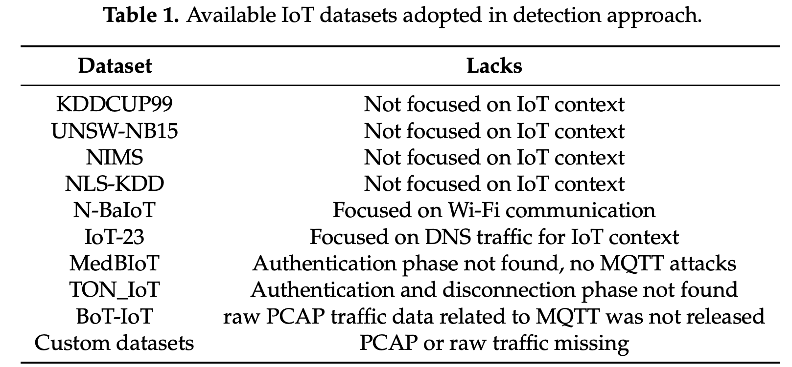
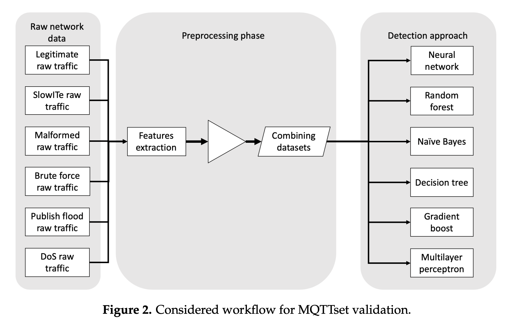
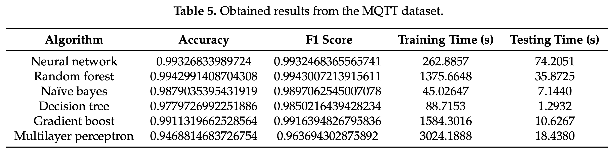

## Title 
Those who don't have a direct source next to them, are from Ivan.

### Problem
- The rapid expansion of the Internet of Things (IoT) phenomenon is considered a key factor of this high number of traffic volume from Li, Y.; Chi, Z.; Liu, X.; Zhu, T. Chiron: Concurrent high throughput communication for iot devices. In Proceedings of the 16th Annual International Conference on Mobile Systems, Applications, and Services, Munich, Germany, 11–15 June 2018, pp. 204–216.
- location and nature of devices make them exchange sensitive information on the network, security of IoT environments is a critical point
- Nevertheless, it is well-known that ML and AI systems require a large amount of well-structured data to be adopted, in order to train models used to identify malicious situatio [4].
- Although it’s designed to be used in IoT environments, MQTT is even adopted for applications external to IoT like mobile health monitoring or push notification services [10–12]
- MQTTset includes both legitimate and malicious traffics and is composed of IoT devices of different nature.
- N-BaIoT is another dataset used to detection and mitigate botnet attacks in the IoT context [31] focused on Wi-Fi communication. Although the adopted datasets are in this case particularly interesting and variegate, authors did not release them publicly. Hence, the possibility to exploit them for research purposes is extremely limited.
- The only dataset available including MQTT traffic is BoT-IoT [35], although, as mentioned before, it does not include raw and extracted network data related to MQTT.

### Approach
- Unlike presented related works on the topic, in this paper we introduce MQTTset, a dataset including raw traffic data related to the MQTT protocol, widely adopted in IoT environments. 
- MQTTset is released both as CSV and PCAP raw data.
- The proposed dataset contains both legitimate and attack traffic, by considering all the data of the communications on the reference scenario (e.g., authentications, disconnection, etc.)
- MQTTset was built by using IoT-Flock, which is a traffic generator that can **emulate IoT networks** using either **MQTT** or **CoAP** (a dual-protocol IoT traffic generator) [42]
- IoT-Flock provides the ability to configure the network scenario, in terms of nodes (e.g., sensor type, IP addresses, listening ports, etc.) and communications
(e.g., time interval used for communications between the sensors and the broker). 
- In addition, the tool implements different cyber-threats against the MQTT and CoAP: publish flood, packet crafting attacks, segmentation fault attack against CoAP (making use of a null Uri-path), and memory leak attacks against CoAP (by using invalid CoAP options during packets forging).
- In order to create a dataset representative of a real network, in our scenario, we deployed different IoT sensors connected to an MQTT broker. Particularly, such broker is based on Eclipse Mosquitto v1.6.2, while the network is composed by 8 sensors. 
- The sensors network is implemented in a limited access area (both physically and virtually) where sensors communicate with the broker. 
- In the network, no additional components (e.g., firewall) are installed. 
- The traffic is captured from the broker itself. Instead, during the attack phases, the malicious node is directly connected to the broker in order to execute the cyber-attacks. The position of the attacker node inside the network is not relevant since its aim is to attack the MQTT broker due to the nature of the selected attacks.
- Each sensor is configured to trigger communication at a specific time, depending on the nature of the sensor.
- The dataset simulates a real behavior of a home automation since sensors communicate based on their functionality(periodic, random).
- Each sensor is set up with a data profile and a topic used by the MQTT broker.
- The data profile consists of the type of data used by the sensors
- The topic is the identifier of the channel used to publish or receive information. 
-  The MQTT broker, identified by the IP address 10.16.100.73, is listening on plain text port 1883.
- The MQTTset dataset includes network traffic related to MQTT version 3.1.1.
-  Authentication is not enabled, hence, no username and password exchange is required to authenticate clients to the
broker.
- Only plain text communications are included.
- Flooding Denial of Service: the MQTT protocol is targeted with the aim to saturate the broker, by establishing several connections with the broker and sending, for each connection, the higher number of messages possible. In order to implement this attack, we adopted the the MQTT-malaria tool [38], usually adopted to test scalability and load of MQTT services.
- MQTT Publish Flood: In this case, a malicious IoT device periodically sends a huge amount of malicious MQTT data, in order to seize all resources of the server, in terms of connection slots, networks or other resources that are allocated in limited amount. Differently on the previous attack, this attack tries to saturate the resources by using a single connection instead of instantiate multiple connections. This attack was generated in this case by using a module inside the IoT-Flock tool [42].
- SlowITe: The Slow DoS against Internet of Things Environments (SlowITe) attack is a novel denial of service threat targeting the MQTT application protocol [14]. Particularly, unlike previous threats, being a Slow DoS Attack, SlowITe requires minimum bandwidth and resources to attack an MQTT service [45–47]. Particularly, SlowITe initiates a large amount of connections with the MQTT broker, in order to seize all available connections simultaneously. Under these circumstances the denial of service status would be reached. 
- Malformed Data: A malformed data attack aims to generate and send to the broker several malformed packets, trying to raise exceptions on the targeted service [48]. Considering MQTTset, in order to perpetrate a malformed data attack, we adopted the MQTTSA tool [49], sending a sequence of malformed CONNECT or PUBLISH packets to the victim in order to raise exceptions on the MQTT broker.
- Brute Force Authentication: A brute force attack consists in running possible attempts to retrieve users credentials used by MQTT [50]. Regarding MQTTset, the attacker’s aim is to crack users’ credentials (username and password) adopted during the authentication phase. Also in this case, we used the MQTTSA tool [49]. Particularly, in order to recall to a real scenario, we adopted the rockyou.txt word list, that is considered a popular list, widely adopted for brute force and cracking attacks [51]. For our tests, the credentials are stored on the word list used by the attacker.

### Dataset / Experiment

- The generated MQTT traffic is represented as a packet capture (PCAP) file , captured during the generation of MQTTset data.
- Capture time refers to a temporal window of one week (from Friday at 11:40 to Friday at 11:45). 
- it is represented by 11,915,716 network packets and an overall size of 1,093,676,216 bytes.
- In order to validate MQTTset, we designed an intrusion detection system, applied on the dataset, combining legitimate MQTT traffic with different cyber-attacks (mentioned above) targeting the MQTT broker of the network.
- The different datasets referring to legitimate and malicious situations were mixed together and used to carry out training and prediction of our algorithms, to validate the possibility to use MQTTset to test and implement a novel intrusion detection algorithm.
- For validation of potential intrusion detection systems, we considered the following algorithms: neural network [52], random forest [53], naïve bayes [54], decision tree [55], gradient boost [56] and multilayer perceptron [57].
-  In each case, a data pre-processing phase is carried out, with the aim of extracting the necessary features able to characterize anomalous, hence attack, traffics/connections.
- All available features able of describing a connection were then recovered directly from the raw network data. Features are extracted and filtered in order to focus on the most relevant ones able to characterize potential attacks and our legitimate traffic.

- All the algorithms have been tested on the same dataset and on the same host.
### Results
- After pre-processing and features extraction stages has been accomplished, and data are combined/mixed to generate a single dataset including both legitimate and malicious traffic data, the aim is now to validate all the intrusion detection algorithms we selected above. Selected algorithms are implemented in Python programming language, by using well known machine learning and artificial intelligence libraries and tools such as Sklearn [58], Tensorflow [59] and Keras [60].
- The detection system must solve a multi-classification problem as it must not only identify an attack but, based on the training phase of the system, also predict the nature and type of attack.
-  The multi-classification approach is considered since in a real scenario, a system could be target for cyber-attacks with different behaviour, payload and characteristics. 
- In order to test the selected intrusion detection algorithms, the dataset has to be splitted into
two parts: training (70% of traffic data, in terms of generated records) and test (the remaining 30%
of traffic data).

- It can be seen how the neural network correctly classifies legitimate traffic while the random forest identifies flood and malformed traffic and finally the naïve bayes algorithm classifies bruteforce attacks. 
- All algorithms are able to identify the SlowITe attack very precisely.