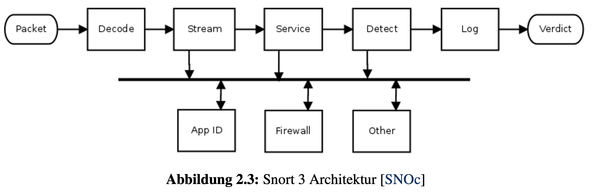
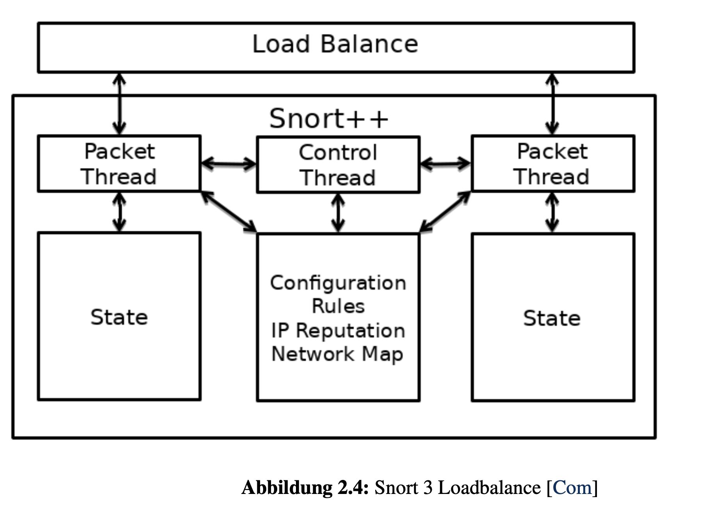
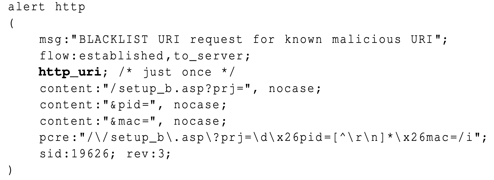
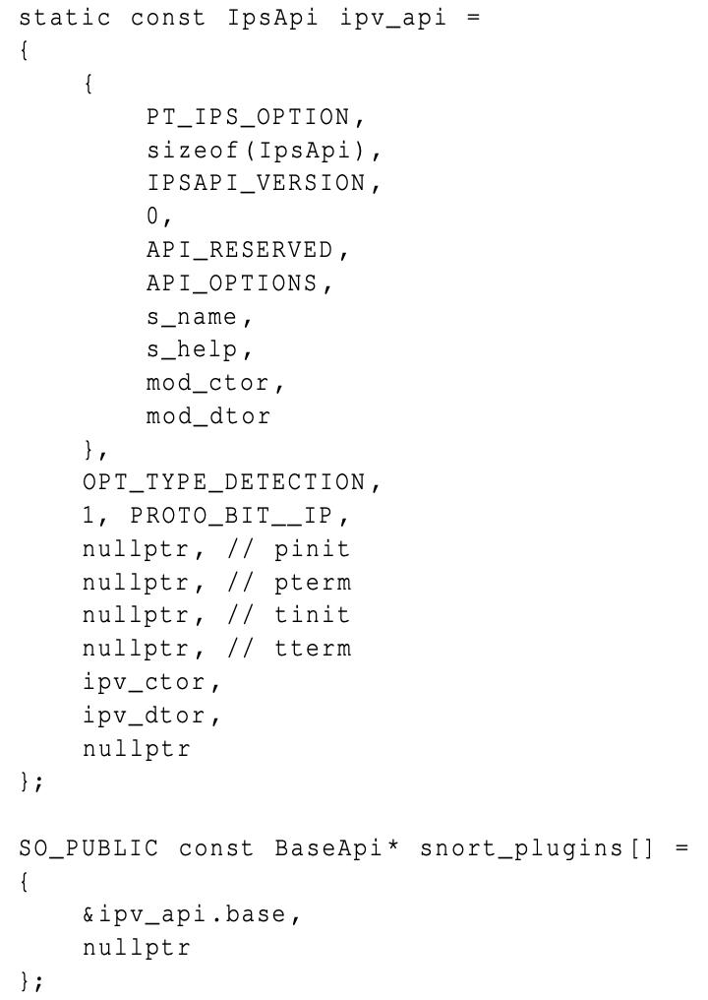

# Entwurf und Implementierung einer IPv6 Erweiterung für das Intrusion Detection System Snort 3.0

- Snort 3 oder auch Snort++ genannt, ist eine inkrementelle Weiterentwicklung von Snort 2 in C++
- Snort 3 versucht die **Skalierungsprobleme** durch:
**die Einführung von Multithread-Support**
zu lösen.
### Skalierungsprobleme:
> Die beiden Plugin-APIs machen Snort2 dynamisch genug um es an neue Angriffsvektoren und neue Protokolle anzugleichen. Damit lässt sich die grundlegende Architektur an neue Anforderungen anpassen, jedoch **skaliert** sie mit gößer werdenden Datenmengen **nicht**. Der beschriebene **Abarbeitungsprozess** ist **single-threaded**. Es existieren Arbeiten die **Netzwerktraffic aufsplitten** und **von mehreren Instanzen analysieren lassen**. Dies kann aber zu einer **verringerten Erkennungsrate** führen, **aufgrund von unpassender Aufspaltung des Netzwerktraffics**. Ein weiteres Problem stellt die **Abarbeitung von Preprocessors** dar. Preprocessoren werden nach Aufbau des Pakets abgearbeitet, dies kann zu nutzlosen Aufrufen führen.

- Neben besserer Skalierung wird versucht, die **Erweiterbarkeit zu verbessern**, sowie **die Konfiguration zu normalisieren**. Da Snort 3 eine **inkrementelle Weiterentwicklung** ist, wurde eine große Menge von C-Code portiert, welcher wieder zu **neuen Unstimmigkeiten** führt.
### Architektur

- DAQ (**Data-Acquisition-Library**) als **Abstraktionsebene** zu libpcap genutzt 
- die **Decoder** besitzen die selbe Aufgabe wie in Snort 2, wurden jedoch in C++ umgeschrieben. 
- Decoder wurden so normalisiert, dass sie leicht erweiterbar sind.
- Die Streamprozessoren zum Zusammensetzen von Fragmenten und Segmenten wurden zu einer eigenständigen Komponente.
- Die anderen Aufgaben der ehemaligen Preprocessors aus Snort 2 wurden auf mehrere Inspektoren aufgeteilt. 
- Netzwerkinspektoren und Serviceinspektoren sind die Wichtigsten:
> Sie ermöglichen es, im Gegensatz zu den sonst kontextlosen Vergleichen normaler Regeln, **Kontext aufzubauen**. Dies wird ermöglicht, durch das **Allokieren von eigenem Speicher** und **das Verwalten von diesem** während der **gesamten Laufzeit**.
- Der größte Unterschied zwischen Inspektoren und Preprocessors ist, dass die **Inpektoren** sogenannte **Insprektorevents auslösen** können.

- Insprektorevents sind die **Lösung für das zweite erwähnte Performance-Problem** in Snort 2. Inspektoren können jetzt mittels des **Observerpattern** *andere Komponenten auslösen*. Somit können viele **Inspektoraufrufe gespart** werden:
> da sie nicht mehr bei jedem TCP-Paket aufgerufen werden, sondern nur für die, für die sie geschrieben wurden.

- App-Ids: Transparenz für Externe Entwickler + Inspektoren beliebig zu erweitern ohne ursprünglichen Code zu verändern
- mithilfe der Events: Post-Detection-Erweiterungen erstellen
- ähnlich wie Decoder wurden die Logger in C++ umgeschrieben und normalisiert
- Snort ist multithread-fähig **ABER**
> Momentan ist es nur möglich, einen Thread pro Paketquelle zu generieren.
- Dies bedeutet, es wird wie unter Snort 2 ein **externer Load-balancer** benötigt um **mehrere Threads pro Interface zu erzeugen**. 

#### Ein Regel in Snort 2
alert tcp $HOME_NET any -> $EXTERNAL_NET $HTTP_PORTS ( msg :"
BLACKLIST URI request for known malicious URI "; flow :
established , to_server ; content :"/ setup_b . asp ? prj ="; nocase ;
http_uri; content :"& pid ="; nocase ; http_uri; content :"& mac
="; nocase ; http_uri; pcre :"/\/ setup_b \. asp \? prj =\ d\ x26pid
=[^\ r\n ]*\ x26mac =/ Ui "; metadata : service http ; sid :19626; rev
:2;)
#### in Snort 3

### Konfiguration
- Die Konfiguration wird in LuaJiT geschrieben.
- Die Konfiguration wird am Start von Snort als Script ausgeführt.
- im Vergleich zu Snort 2 sinnvolle Konfigurationsfehlermeldungen vor dem Beenden von Snort angezeigt.
- Jede Einstellung in der Konfiguration kann jetzt durch Kommandoparameter überschrieben werden
- die Struktur von Werten wurde standardisiert.
- ein neues Feature namens Binder
    - Mittels Binder kann genauer definiert werden, wann bestimmte Inspektoren aufgerufen werden
    - Inspektoren werden sonst **wie in Snort 2** bei **TCP**, **UDP** oder **IP** aufgerufen
    - Nun: wenn das PDU einen bestimmten Zielport besitzt

### Plug-Ins
- Eines der Ziele von Snort 3: eine **Plugin-API** für fast jede Komponente in Snort -> die **Erweiterbarkeit** weiter zu erhöhen
    - Decoder - um Pakete zu dekodieren
    - Inspektoren - siehe 2.2.1
    - IPsOptions - neue Optionen in Regeln
    - IpsActions - neue Aktionen, die bei einem Treffer ausgeführt werden sollen
    - Logger - neue Outputformen
    - Mpse - Plugin für schnelle Mustererkennung
    - So - Plugin zur Erstellung von dynamischen Regeln

>In jedem Plugin wird ein **snort_plugins Array** erstellt, in dem **eine Instanz der entsprechenden API** vorhanden ist

### Options

##### (Oben nur der Konstruktor und Destruktor für die eigentlich Option inkludiert: beide sind Konstruktoren verschieden, einer erstellt das Modul und der andere erstellt aus dem Modul anschließend die eigentliche Option. Diese Teilung ist sinnvoll, denn **Module existieren in allen Arten von Plugins**.)

- In der IpsApi werden **Typ des Plugin** und **API-Optionen** definiert.
- ```s_name``` der Name des Plugins
- ```s_help``` die Hilfe, die mit der Snort-Kommandozeile
- der Konstruktor und Destruktor des Moduls
- der base lässt sich der Typ der Regel und der Typ des zu analysierenden Verkehrs angegeben
- Callbacks lassen sich registrieren für Funktionen, die ausgeführt werden sollen, wenn ein neuer Thread oder Prozess erstellt wird oder terminiert wird. 

- Die Funktion operator== wird benötigt, um zu verhindern, dass mehrere Instanzen der selben Opti on existieren. Ohne diese Funktion würden mehrere Instanzen einer identischen Option existieren, wenn sie in mehreren Regeln vorkommt.

### Inspektor
- Die Inspektor-API ist fast identisch mit der Regel-API.
- Einziger Unterschied: Inspektoren auch nicht positionelle Parameter in der Konfiguration benutzen können.
- hat eine **eval** Funktion, **void**
- Sollte ein Inspektor eine **Aktion** ausführen wollen, erzeugt er ein **Inspektorevent**.

### IPv6 Unterstützung
- Snort 2 und 3 IPv6-fähig: IPv6-Pakete dekodieren und auf höhere Protokollebenen derer zu zugreifen
- Keine Regeloptionen -> auf die neuen IPv6-Felder nicht zugreifen zu können
- Stattdessen werden bekannte IPv4-Felder auf die nächst ähnlicheren IPv6-Felder abgebildet -> gut für Felder wie TTL in IPv4 und Hop-Limit in IPv6