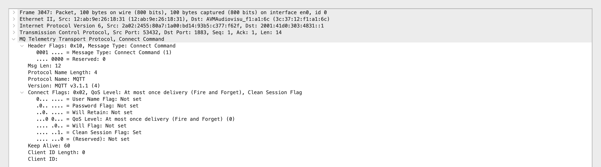
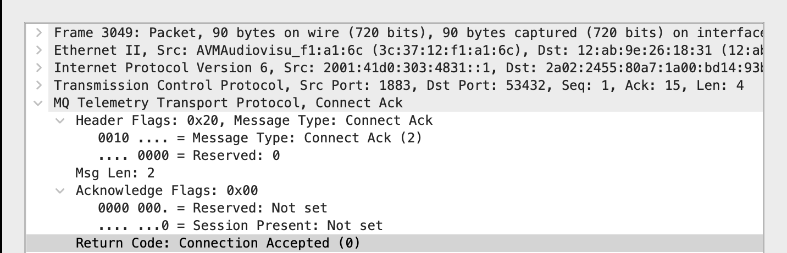
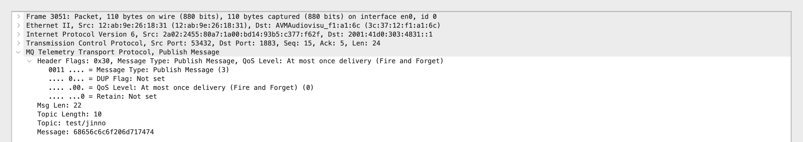
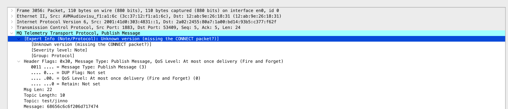
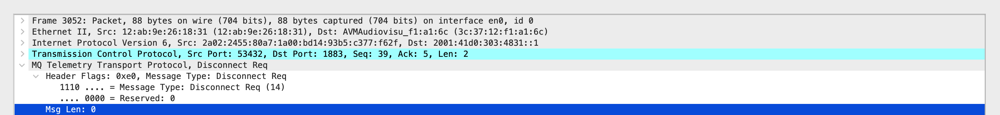

# MQTT Packets
- Mehrere PUBLISH packets -> Kein Replay attack, Replay wäre eher “gleiches Paket wiederholt in derselben Richtung / gleicher Flow”; da hier die Richtung umgekehrt ist (ich->broker, broker->ich) -> **fan-out** 

## Which observable protocol events can be converted into stable, meaningful features for detection? inspector anlegen, registrieren, publish parsen und topic publizieren + Vorlage ausfüllen für Gantt Chart

### Semantische Felder:
- Inspector Event: session_start
- Protocol Version: MQTT v3.1.1
- Clean Session Flag: true
- Session Persistence Intent: ephemeral (no state retention)
- Keep Alive: 60 seconds
- Authentication Used: false (username/password not set)
- Will Message Present: false
- Client ID Present: false (length = 0)

### Semantische Felder:
Inspector Event: session_accepted or session_rejected
Session present flag:false or true

### Semantische Felder:
- dst_port == 1883 → publish_sent
- src_port == 1883 → publish_received

### Semantische Felder:
- Inspector Event: publish_received
- Publish Direction: broker → client
- Topic: test/jinno
- Topic Depth: 1
- QoS Level: 0 (at most once)
- DUP Flag: false
- RETAIN Flag: false
- Payload Length: 16 bytes
- Payload Type: opaque / binary
- Broker Fan-out: true (forwarded publish)

### Semantische Felder:
- Inspector Event: session_end
- Disconnect Direction: client → broker
- Disconnect Type: graceful (DISCONNECT packet)
- Session Termination Intent: explicit
- Remaining Payload: none (Msg Len = 0)
- Session Cleanup Triggered: yes (clean session semantics apply)
>The client publsih program automatically performs a clean shutdown by sending MQTT DISCONNECT before the TCP connection closes.

Typically see two kinds of “ending” in captures:

- MQTT DISCONNECT (application-layer goodbye)
- TCP FIN/ACK (transport-layer connection teardown)

Both can appear. They serve different layers.

- Abschlussarbeit von MQTT
- Netzwerktopologie von Warfia benutzen
- Welche Angriffe gibt es 
- In Datensatzt gucken was brauchen wir um den Angriff zu erkennen
- MQTTset